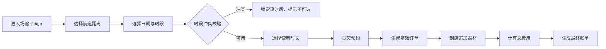

## 1. 产品概述

室内射箭馆箭道分时预约与器材租赁结算系统，为射箭场馆提供箭道工位预约、器材租赁计费、订单结算等全流程数字化管理。顾客可通过场馆平面视图选择箭道及时段进行预约，到店后可追加租赁护臂、专业弓箭等器材，系统自动核算箭道基础费与器材租赁费并生成完整账单。门店后台支持多人同行套餐优惠配置，所有时段冲突校验、金额计算均在系统内部闭环完成。

## 2. 核心功能

### 2.1 用户角色

| 角色 | 登录方式 | 核心权限 |
|------|----------|----------|
| 顾客 | 免登录访客 | 浏览箭道、提交预约、租赁器材、查看账单 |
| 门店管理员 | 账号密码登录 | 管理箭道配置、套餐设置、订单查看、数据统计 |

### 2.2 功能模块

1. **场馆平面页面（3863）**：箭道工位可视化展示、时段选择、预约下单
2. **订单结算模块（8863）**：箭道费用计算、器材租赁计费、套餐优惠、账单生成
3. **器材租赁模块**：护臂、专业弓箭等器材选择与费用叠加
4. **门店后台管理**：箭道配置、套餐设置、订单管理
5. **时段冲突校验**：实时检测预约时段是否冲突，冲突时段锁定

### 2.3 页面详情

| 页面名称 | 模块名称 | 功能描述 |
|----------|----------|----------|
| 场馆平面页 | 箭道工位分布图 | 可视化展示全部箭道，按距离分类，显示占用/空闲状态 |
| 场馆平面页 | 时段选择器 | 选择使用日期和时段，实时校验冲突 |
| 场馆平面页 | 预约提交 | 选择箭道距离、使用时长，提交预约订单 |
| 器材租赁页 | 器材列表 | 展示可租赁器材（护臂、专业弓箭等）及单价 |
| 器材租赁页 | 租赁选择 | 勾选需要租赁的器材，自动计算租赁费用 |
| 订单结算页 | 费用明细 | 展示箭道费、器材费、套餐优惠、应付总额 |
| 订单结算页 | 账单确认 | 确认订单信息，生成最终账单 |
| 后台管理页 | 箭道管理 | 配置箭道编号、距离类型、基础价格 |
| 后台管理页 | 套餐管理 | 设置多人同行套餐优惠规则 |
| 后台管理页 | 订单管理 | 查看全部订单、订单状态管理 |

## 3. 核心流程

### 3.1 预约主流程

顾客进入场馆平面页面 → 选择箭道距离类型 → 选择使用日期和时段 → 系统校验时段冲突 → 选择使用时长 → 提交预约 → 生成基础订单 → 到店后追加器材租赁 → 计算总费用 → 确认账单

### 3.2 计费逻辑

箭道基础费 = 箭道单价 × 使用时长
器材租赁费 = Σ(器材单价 × 租赁数量)
套餐优惠 = 满足条件时按规则减免
应付总额 = 箭道基础费 + 器材租赁费 - 套餐优惠

## 4. 用户界面设计

### 4.1 设计风格

- **主色调**：深墨绿（#1A3A2A）+ 古铜金（#B8860B），营造专业射箭运动的沉稳质感
- **辅助色**：象牙白（#FFFFF0）、深棕（#4A3728）
- **按钮风格**：圆角矩形，古铜金描边，悬停时有微光泽效果
- **字体**：标题使用「Noto Serif SC」衬线体，正文使用「Noto Sans SC」无衬线体
- **布局风格**：卡片式布局，顶部导航栏，侧栏筛选
- **图标风格**：线性图标，古铜金色，射箭主题元素

### 4.2 页面设计概览

| 页面名称 | 模块名称 | UI 元素 |
|----------|----------|---------|
| 场馆平面页 | 箭道分布图 | 网格布局的箭道工位卡片，不同距离用不同颜色标识，占用状态灰度显示 |
| 场馆平面页 | 时段选择条 | 横向时间轴，已占用时段红色标记，可选时段绿色高亮 |
| 器材租赁页 | 器材卡片 | 图片+名称+单价+数量选择器，勾选后加入租赁清单 |
| 订单结算页 | 费用明细 | 逐项列出费用，优惠项红色标注，总计醒目显示 |
| 后台管理页 | 数据面板 | 顶部数据概览卡片，下方功能区 Tab 切换 |

### 4.3 响应式

- 桌面端优先设计，1440px 基准宽度
- 平板端（768px-1024px）：箭道网格自适应列数，侧栏转为顶部筛选
- 移动端（<768px）：单列布局，底部导航，时段选择改为下拉

### 4.4 动效设计

- 箭道状态切换：平滑过渡动画，0.3s 缓动
- 预约确认：按钮缩放反馈 + 成功勾选动画
- 费用计算：数字滚动累加效果
- 页面切换：淡入淡出 + 轻微位移
