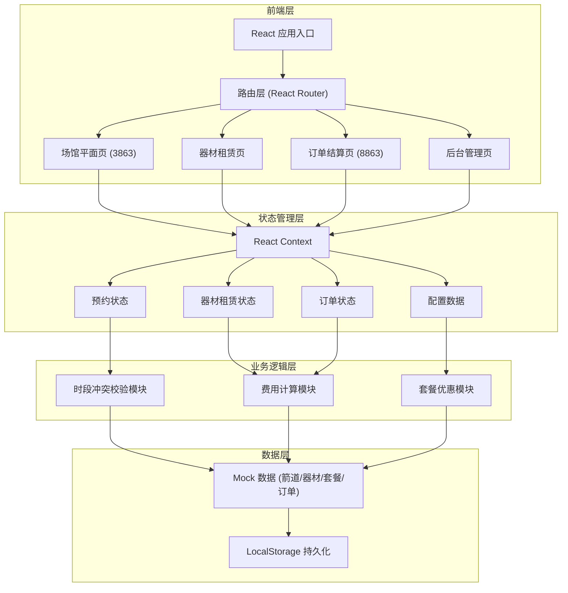

## 1. 架构设计



## 2. 技术选型

- **前端框架**：React@18 + TypeScript
- **构建工具**：Vite@5
- **样式方案**：TailwindCSS@3
- **路由管理**：React Router DOM@6
- **状态管理**：React Context + useReducer
- **图标库**：Lucide React
- **数据持久化**：LocalStorage
- **Mock 数据**：静态 JSON 数据 + 内存状态

## 3. 路由定义

| 路由路径 | 页面名称 | 功能描述 |
|----------|----------|----------|
| `/` | 场馆平面页 | 箭道展示、时段选择、预约提交 |
| `/equipment` | 器材租赁页 | 器材浏览、租赁选择 |
| `/checkout` | 订单结算页 | 费用明细、账单确认 |
| `/admin` | 后台管理页 | 箭道配置、套餐管理、订单查看 |

## 4. 核心数据模型

### 4.1 箭道 (Lane)

```typescript
interface Lane {
  id: string;
  name: string;
  distance: number; // 箭道距离（米）：10, 18, 30, 50
  pricePerHour: number; // 每小时基础费用
  status: 'available' | 'occupied' | 'maintenance';
  bookings: Booking[];
}
```

### 4.2 器材 (Equipment)

```typescript
interface Equipment {
  id: string;
  name: string;
  category: 'armguard' | 'bow' | 'arrow' | 'glove' | 'other';
  pricePerDay: number; // 单日租赁费用
  stock: number; // 库存数量
  description: string;
  imageUrl: string;
}
```

### 4.3 预约记录 (Booking)

```typescript
interface Booking {
  id: string;
  laneId: string;
  date: string; // YYYY-MM-DD
  startTime: string; // HH:mm
  endTime: string; // HH:mm
  customerName: string;
  customerPhone: string;
  status: 'pending' | 'confirmed' | 'completed' | 'cancelled';
  createdAt: string;
}
```

### 4.4 订单 (Order)

```typescript
interface Order {
  id: string;
  bookingId: string;
  laneFee: number;
  equipmentFee: number;
  packageDiscount: number;
  totalAmount: number;
  equipmentRentals: EquipmentRental[];
  status: 'unpaid' | 'paid' | 'refunded';
  createdAt: string;
}

interface EquipmentRental {
  equipmentId: string;
  equipmentName: string;
  quantity: number;
  pricePerDay: number;
  subtotal: number;
}
```

### 4.5 套餐优惠 (Package)

```typescript
interface Package {
  id: string;
  name: string;
  type: 'group' | 'duration' | 'combo';
  minPeople?: number; // 最少人数
  minDuration?: number; // 最少时长（小时）
  discountType: 'percentage' | 'fixed'; // 折扣类型
  discountValue: number; // 折扣值（百分比或固定金额）
  description: string;
  active: boolean;
}
```

## 5. 核心业务逻辑

### 5.1 时段冲突校验算法

```
函数: checkTimeConflict(laneId, date, startTime, endTime)
  1. 获取该箭道指定日期的所有预约记录
  2. 遍历每条预约记录：
     - 若新预约开始时间 < 已有预约结束时间 且 新预约结束时间 > 已有预约开始时间
     - 则判定为冲突，返回 false
  3. 所有记录均不冲突，返回 true
```

### 5.2 费用计算逻辑

```
箭道费用 = 箭道单价 × 使用时长（向上取整到半小时）
器材费用 = Σ(器材单价 × 租赁数量)
套餐优惠 = 计算满足条件的最大优惠
应付总额 = 箭道费用 + 器材费用 - 套餐优惠
```

### 5.3 套餐优惠匹配

遍历所有启用的套餐，找到满足条件且优惠金额最大的套餐应用。

## 6. 目录结构

```
src/
├── components/          # 通用组件
│   ├── Layout/         # 布局组件
│   ├── LaneCard/       # 箭道卡片
│   ├── TimeSelector/   # 时段选择器
│   ├── EquipmentCard/  # 器材卡片
│   └── OrderSummary/   # 订单摘要
├── pages/              # 页面组件
│   ├── VenueMap/       # 场馆平面页
│   ├── Equipment/      # 器材租赁页
│   ├── Checkout/       # 订单结算页
│   └── Admin/          # 后台管理页
├── context/            # 状态管理
│   ├── BookingContext.tsx
│   ├── OrderContext.tsx
│   └── ConfigContext.tsx
├── data/               # Mock 数据
│   ├── lanes.ts
│   ├── equipment.ts
│   ├── packages.ts
│   └── orders.ts
├── utils/              # 工具函数
│   ├── timeUtils.ts    # 时间处理
│   ├── priceUtils.ts   # 费用计算
│   └── validation.ts   # 校验逻辑
├── types/              # TypeScript 类型定义
│   └── index.ts
├── App.tsx
├── main.tsx
└── index.css
```
